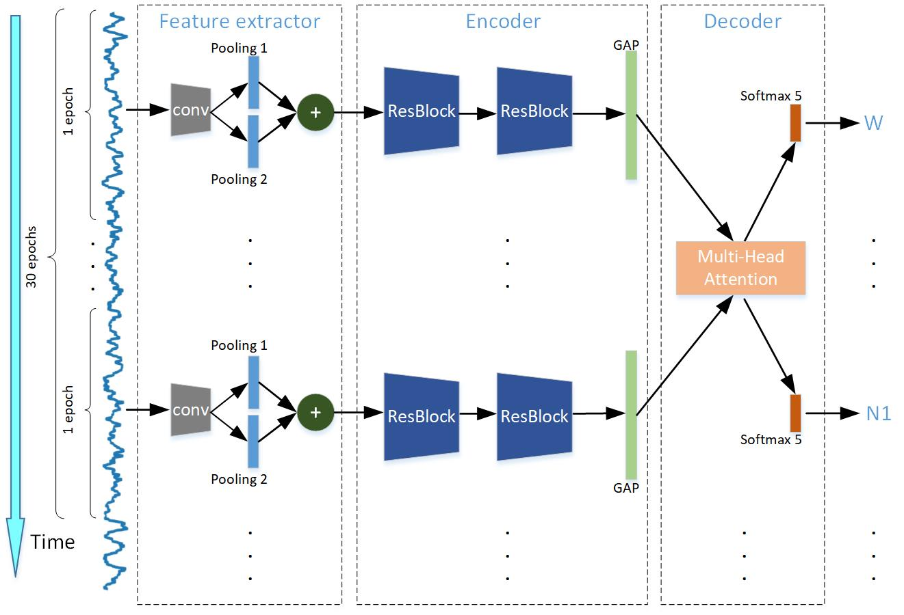

# A Residual based Attention Model for EEG basedSleep Staging
Implementation of the paper: `A Residual based Attention Model for EEG basedSleep Staging`. Link [here](https://ieeexplore.ieee.org/document/9022981).

The architecture of the network:



Use `data/download_physionet.sh` to download sleep-EDF.

Use `prepare_physionet.py` and `prepare_mass.py` to prepare sleep-EDF and MASS respectively.

Run `batch_train.sh` to run training on each fold.

For example, run a training for 31 folds on channel C3 using GPU 2:
```./batch_train.sh mass/C3 output_C3 0 30 MASS 2```